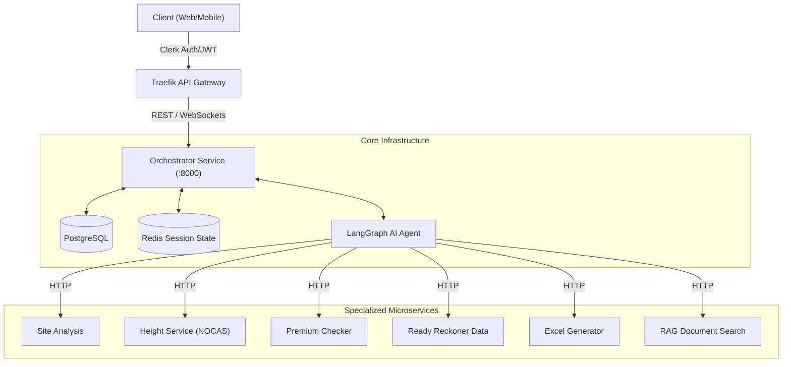

<div align="center">
  <h1>🏢 Dhara AI — Redevelopment Orchestrator</h1>
  <p><strong>Automated Mumbai Housing Society Redevelopment Feasibility Platform</strong></p>
  
  <p>
    An enterprise-grade agentic system utilizing Claude (Anthropic), LangGraph, and a fleet of specialist microservices to produce high-fidelity financial and regulatory feasibility studies for real estate redevelopment projects under DCPR-2034.
  </p>
</div>

---

## 🏗 System Architecture

Dhara AI employs an **Agentic Microservices Architecture**. The core orchestrator handles authentication, RBAC, state management, and real-time LLM streaming, offloading specialized deterministic tasks to isolated microservices.



## 🚀 Tech Stack

- **Framework**: `FastAPI` (Python 3.11+) + `uvicorn`
- **Database**: PostgreSQL with `SQLAlchemy 2.0` (asyncpg) + `Alembic`
- **Agent Intelligence**: `Anthropic Claude 3.5 Sonnet` / `LangGraph`
- **Caching & State**: `Redis`
- **Authentication**: `Clerk` (Dual-layer JWT verification)
- **Infrastructure**: `Docker`, `Docker Compose`, `Traefik`
- **Package Management**: `uv`

## 🗂 Monorepo Structure

Dhara AI is organized as a professional monorepo with clear boundaries between source code, applications, documentation, and operational artifacts.

```text
repo/
├── services/           # Deployable backend microservices
│   ├── orchestrator/   # Core API & Agentic Logic
│   ├── rag_service/    # Vector-based search
│   └── ...
├── apps/               # Frontend applications (e.g., dhara-ui)
├── shared/             # Shared libraries and configurations
├── docs/               # Architecture, diagrams, and planning
├── scripts/            # Operational and maintenance scripts
└── artifacts/          # Ignored local logs, reports, and screenshots
```

### 🏢 Orchestrator Layered Pattern
The main orchestrator follows a strictly decoupled, layered architecture to ensure maintainability:

```text
services/orchestrator/
├── agent/            # AI loop, LangGraph runner, tools, prompts
├── core/             # App settings, security, RBAC dependencies
├── db/               # Async engine, session factories, seed data
├── models/           # SQLAlchemy ORM models
├── repositories/     # Data access layer (Decoupled Persistance)
├── routers/          # FastAPI sub-routers
├── schemas/          # Pydantic validation/I-O schemas
├── services/         # Pure Business Logic
└── main.py           # App factory
```

## 🛠 Features

* **Real-time WebSockets**: Agent execution streamed over WebSockets for live UI progress updates.
* **Role-Based Access Control (RBAC)**: Fine-grained permissions (Admin, PMC, Builder, Society, Lawyer).
* **Multi-Provider LLM Support**: Drop-in support for Anthropic, Ollama, OpenAI-compatible APIs, or Mock Mode for offline development.
* **Background Tasks**: Non-blocking email dispatches and async DB transactions.
* **Secure Assets**: Upload handling directly to Cloudinary.

---

## 🚦 Microservice Fleet

| Service | Port | Responsibility |
|---------|------|----------------|
| **orchestrator** | `8000` | State management, AI reasoning loop, API gateway |
| **site_analysis**| `8001` | Google Maps validation, plot inference |
| **height_service**| `8002` | Rule calculations against NOCAS limits |
| **ready_reckoner**| `8003` | Gov IGR rates data extraction |
| **premium_checker**|`8004` | DCPR 2034 Gov charge computations |
| **report_generator**|`8005` | 7-sheet standardized Excel `.xlsx` generation |
| **pr_card_scraper**|`8006` | Automated property card fetching |
| **rag_service** | `8007` | Vector-based document querying |

---

## 💻 Developer Setup

### 1. Prerequisites
- Docker & Docker Compose
- Clerk Account (JWT Management)
- Anthropic API Key (or local LLM via Ollama)
- PostgreSQL & Redis (Provided via Docker compose)

### 2. Environment Configuration
Duplicate the `.env.example` file and configure your credentials:
```bash
cp .env.example .env
```

Ensure the following critical variables are set:
* `DATABASE_URL` (Postgres connection string)
* `CLERK_SECRET_KEY` & `CLERK_JWT_KEY`
* `GEMINI_API_KEY` (or `ANTHROPIC_API_KEY` / `OLLAMA_BASE_URL`)

### 3. Spin Up Infrastructure
Start the entire microservice fleet:
```bash
docker-compose up --build -d
```

### 4. Database Migrations
Once the database container is up, initialize the schema:
```bash
docker-compose exec orchestrator alembic upgrade head
```

---

## 🔌 Core APIs

**Authentication:** Most endpoints expect a valid Clerk JWT passed as `Authorization: Bearer <token>`.

| Route Segment | Description |
|---------------|-------------|
| `/api/auth/*` | Login/Signup/Password mgmt |
| `/api/societies/*` | CRUD operations for Housing Societies |
| `/api/feasibility-reports/*` | Report generation and history tracking |
| `/api/team/*` | Collaborate via internal app invites |
| `/api/admin/*` | Global RBAC and user supervision |
| `/ws/agent` | WebSocket streaming of LLM run logic |

**Comprehensive API documentation** is auto-generated by FastAPI at:
👉 `http://localhost:8000/docs`

---

## 📄 License
Private & Confidential. All rights reserved.
